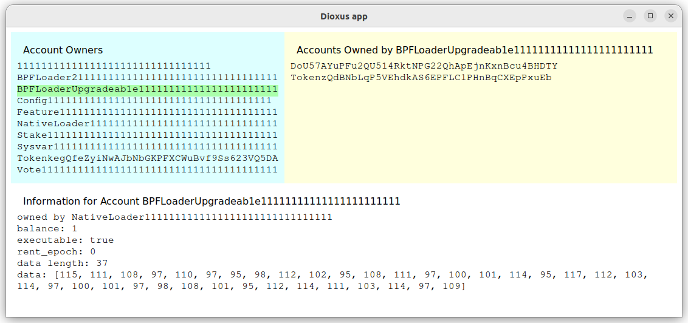

GUI for browsing Solana ledger accounts
=======================================

This application displays Solana ledger accounts. To run the program
have a ledger stored locally, for example, from running
solana-test-ledger application, then point the solana-account-viewer
to the path of the ledger

```
cargo r -- -l path/to/test-ledger --include-sysvars
```

To build on Linux the following dependencies need to be installed

```
sudo apt install libwebkit2gtk-4.1-dev libgtk-3-dev libayatana-appindicator3-dev
```

The GUI window is divided in 3 panels. The left panel displays pubkeys
of accounts that own other accounts.  When an owner is selected the
right panel displays the list of accounts owned by the account
selected in the left panel. The bottom panel display the account
information for selected account either from left or right panel. Some
accounts like NativeLoader account don't have account information in
the ledger, they're only owners of other accounts. For such accounts
no information is shown in the bottom panel.


